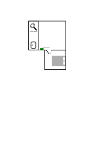

# Web of Things Quick Start Tutorial

This is a hands-on tutorial to teach simple Web of Things concepts. It involves interacting with different WoT Things over the Internet via different protocols.

## Resources and Prerequisites

- package.json with dependencies: This will install the dependencies needed. Please use `npm install` to install the dependencies.
- index.js with boilerplate: You should fill this with your own code.

You can clone this repository or download a zipped version of this folder from <https://drive.google.com/file/d/1eH-31qffru7nw-ccC2_8PK92hSIlYmit/view?usp=sharing>

### Prerequisites

- Node.js 18: You can install via the [official download page](https://nodejs.org/en/download).
- Optional: HTTP, CoAP and MQTT clients if you want to debug or understand what happens behind node-wot. Some recommended ones:
  - HTTP: [CLI-based](https://curl.se/) | [UI-based](https://www.postman.com/)
  - CoAP: [CLI-based](https://www.npmjs.com/package/coap-cli) | [UI-based](https://github.com/mkovatsc/Copper4Cr)
  - MQTT: [CLI-based](https://mosquitto.org/download/) | [UI-based](https://mqttx.app/downloads)

## Task

You want to automate a small part of your home. The room setup can be seen in the illustration below.

Each morning, when you wake up and go towards the kitchen area, you want the coffee to be brewed automatically.
Your task is to write a script that brews the coffee of your choice when you pass in front the presence sensor in the kitchen if it is earlier than 13:00 but later than 5:00.

We have three WoT Things that are hosted by the Eclipse Thingweb project. Their TDs are linked below:

- Coffee Machine - [TD Link](https://zion.vaimee.com/things/urn:uuid:6823008a-032a-4e82-af03-7cb40231fbfe)
- Presence Sensor - [TD Link](https://zion.vaimee.com/things/urn:uuid:0a028f8e-8a91-4aaf-a346-9a48d440fd7c)
- Smart Clock - [TD Link](https://zion.vaimee.com/things/urn:uuid:913cf8cb-3687-4d98-8d2f-f6f27cfc7162)

You can interact with them over the Internet and send requests.
You should read their Thing Description to understand how to interact with them.
The Node.js based library, [node-wot](https://github.com/eclipse-thingweb/node-wot), simplifies this process and will be installed as a dependency.

## Solution

A solution will be provided after W3C TPAC 2023.

## Self-hosting the Things

If you want, you can also self-host the Things used in this tutorial. They are available in the Eclipse Thingweb project at <https://github.com/eclipse-thingweb/node-wot/tree/master/examples/quickstart>.
